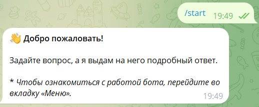
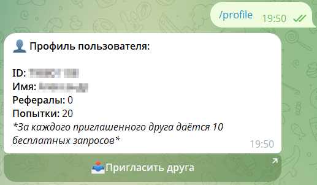
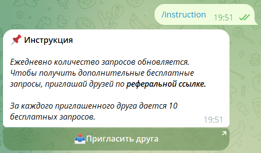
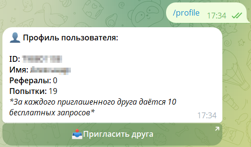
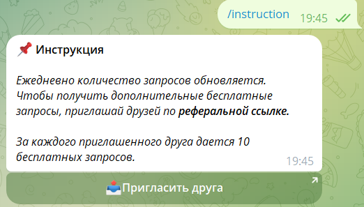
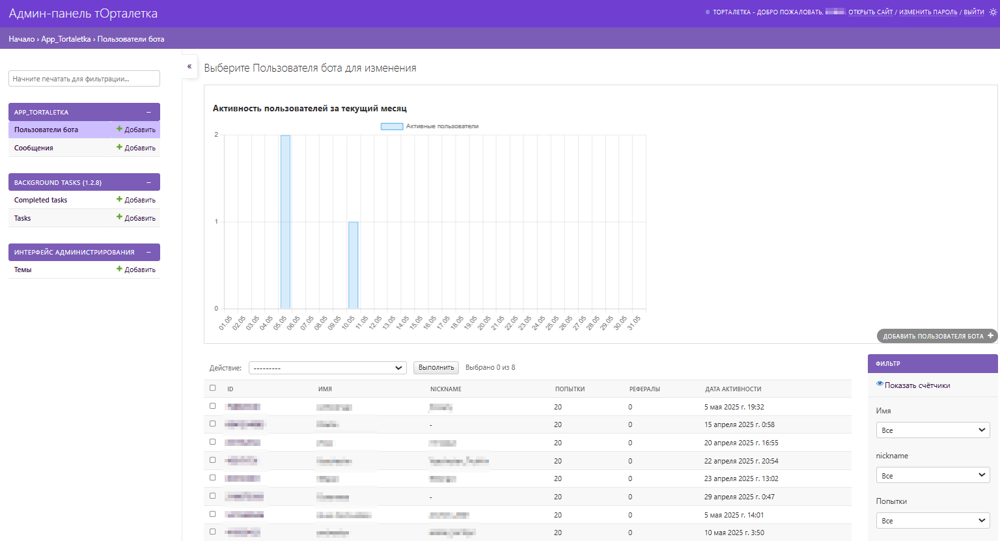
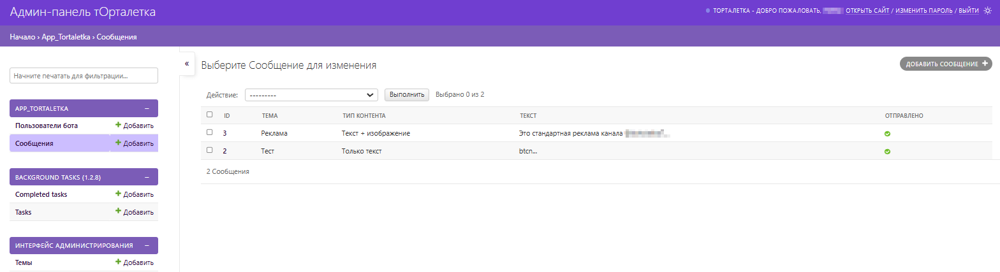
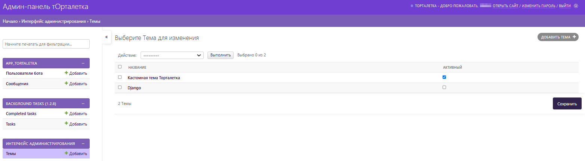
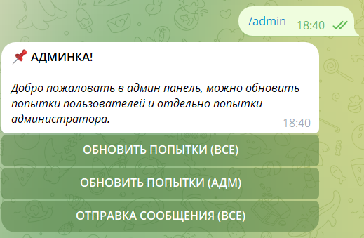

# tortaletkabot

Telegram-бот с интеграцией GigaChat API, админ-панелью на Django. Требует подписки на канал для использования.
Создан для телеграм сообщества - **t.me/tortaletka7**

## 🌟 Особенности

- **🤖 Умный чат**: Ответы через API GigaChat с поддержкой контекста
- **🔑 Привязка к каналу**: Обязательная подписка на ваш Telegram-канал
- **📊 Двойная админ-панель**:
  - Веб-интерфейс Django с продвинутой статистикой
  - Встроенные команды администрирования в самом боте
- **🎯 Реферальная система**:
  - +10 попыток за каждого приглашенного друга
  - Кнопки для отправки реферальной ссылки в профиле и инструкции
- **⏳ Лимиты**:
  - 20 бесплатных попыток/день
  - Автосброс попыток в 00:00 UTC
- **💰 Монетизация**:
  - Потенциал для рекламных интеграций

## 🛠 Установка

1. Клонировать репозиторий:
   ```
   git clone https://github.com/jforsety/tortaletkabot.git
   cd tortaletkabot
   ```
2. Установить зависимости:
    ```
    python -m venv venv
    source venv/bin/activate  # Linux/MacOS
    venv\Scripts\activate  # Windows
    pip install -r requirements.txt
    ```
## ⚙ Настройка

1. Создать .env файл (env_prod в репозитории):
    ```
    # Telegram
    TOKEN_BOT='ваш_токен'
    ADMIN_ID='ваш_id'
    CHANNEL_ID='id_канала'
    CHANNEL_URL='https://t.me/ваш_канал'
    URL_BOT='https://t.me/ваш_бот'

    # GigaChat
    AUTHORIZATION_KEY='ваш_ключ'

    # Django
    SECRET_KEY_DJANGO='ваш_secret_key'
    ALLOWED_HOSTS=yourdomain.com,localhost,127.0.0.1```
   
2. Применить миграции:
    ```
    python manage.py migrate
    python manage.py collectstatic
   ```
   
3. Создать админа:
    ```
    python manage.py createsuperuser
    ```
   
## 🚀 Запуск

1. Запустить бота и сервер:
    ```
    python manage.py startbot  # Запуск бота
    python manage.py runserver # Запуск Django-сервера
    ```
   
_Важно: Добавьте бота админом в целевой канал для проверки подписок!_

## 🤖 Использование бота

### Обязательные условия:

1. Подписка на канал
2. Бот должен быть администратором канала

### Основные команды:

* /start - активация с проверкой подписки
* 
* /profile - личный кабинет, баланс попыток и рефералов
* 
* /instruction - краткая инструкция
* 
* /reset - сброс контекста диалога

### Реферальная система:

* Нажмите "Пригласить друга" в профиле или инструкции
* 
* 
* Отправьте свою ссылку
* Получайте +10 попыток за каждого друга

## 🛠 Администрирование

### Веб-интерфейс (Django Admin)
http://localhost:8000/admin

* Управление пользователями и просмотр статистики

* Массовая рассылка сообщений

* Редактирование темы оформления


### Команды в боте (для админов)

* /admin - При вводе команды доступны функции администратора.


## 🛠 Технологический стек

* [Aiogram 3.17](https://docs.aiogram.dev/en/v3.20.0.post0/)
* [Django 5.1](https://docs.djangoproject.com/en/5.2/)
* [GigaChat API](https://developers.sber.ru/portal/products/gigachat-api)

## ☎️ Поддержка:
[Контакты разработчика](https://t.me/jforsety) | [Баг-репорты](https://github.com/jforsety/tortaletkabot/issues)